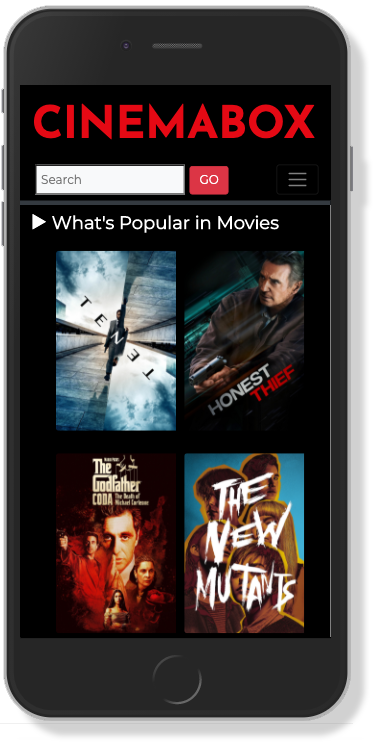

# CINEMABOX - Frontend

### IMPORTANT: BACKEND IS IN ANOTHER REPO CALLED: cinema_box_backend

App about movies and TV shows. It allows you to keep up to date with the latest releases and the greatest hits of the moment. You can save your favorite movies and series so you don't miss anything.

It is a MERN application, built with MongoDB, Express, React and Node.



## Starting 🚀

Instructions for getting a copy of the working project on your local machine for development and testing purposes.

### Requirements 📋

* Fork this repo.
* Clone this repo.

### BACKEND Installation 🔧

Install all dependencies described in package.json:

```
$ npm install
```

Start the back at http://localhost:3000/

```
$ npm run dev
```

### FRONTEND Installation 🔧

Install all dependencies described in package.json:

```
$ npm install
```

Start your REACT app at http://localhost:3000/

```
$ npm start
```

IMPORTANT: You will need the Api Keys to be able to use the app.

## Deployment 📦

App designed and optimized for mobile devices.

LIVE DEMO:

https://pending.com/

## Built with 🛠️

* [React](https://reactjs.org/) - Open source Javascript library designed to create user interfaces on a single page.
* [MongoDB Atlas](https://www.mongodb.com/cloud/atlas) - Multi-cloud database service for MongoDB.
* [Mongoose](https://mongoosejs.com/) - MongoDB object modeling for node.js.
* [Express](https://expressjs.com/) - Backend web application framework for Node.js.
* [Axios](https://www.npmjs.com/package/axios) - Promise based HTTP client for the browser and node.js.
* [Bootstrap](https://getbootstrap.com/) - Front-end styles.
* [TheMovieDB](https://developers.themoviedb.org/3/getting-started/introduction) - API for movies/tv shows.
* [OMDb](http://www.omdbapi.com/) - API for movies/tv shows.
* [Heroku](https://www.heroku.com/) - For backend deployment.
* [Netlify](https://www.netlify.com//) - For frontend deployment.

## Author ✒️

* **Iván Urra** - [ivanurra](https://github.com/ivanurra)

## License 📄

© 2020 Copyright: Iván Urra.

Personal and non-commercial use.